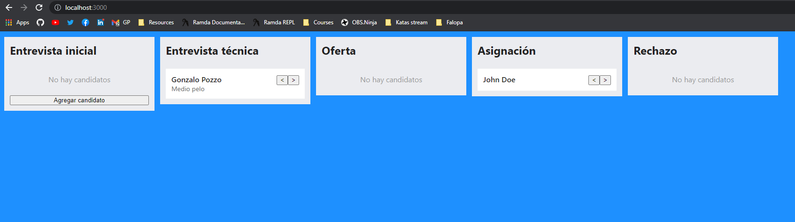

# Cognizant Softvision challenge


Necesitamos una manera interna, fácil de poder administrar nuestros candidatos basado en que paso se encuentran, vivimos en un universo paralelo donde trello ni kanban existen pero se nos ocurrió una genial idea donde nos organizamos usando columnas y filas.

Debemos implementar una columna por cada uno de los pasos de nuestro proceso (`"Entrevista inicial" | "Entrevista técnica" | "Oferta" | "Asignación" | "Rechazo"`), donde podamos tener candidatos que podamos mover entre columnas, una a la vez, sin saltar columnas. También podemos agregar candidatos a la primera columna y cada candidato puede tener opcionalmente un texto de comentario para saber como le está yendo en el proceso. Los candidatos pueden avanzar o retroceder con botones que se encuentran dentro de sus tarjetas.

El cliente nos dejó este proyecto configurado con React y SASS, pero nos dijo que podemos usar lo que queramos. También nos dejó un mock para traer los candidatos en `/api/candidates.json` y nos pidió que implementemos el método de `/api/index.ts` para que devuelva una promesa así es más fácil de implementar el backend cuando lo tengamos.

También nos dijo que no era requerido, pero nos iba a pagar un importante bono por cada punto extra:
* Tests de integración con Cypress
* Tests unitarios con Jest y React Testing Library
* Guardar el progreso de los candidatos en localStorage

Como el cliente no sabe de desarrollo nos pidió que despleguemos nuestra aplicación en algún lado y le mandemos un link para ver el progreso.

Nos dejó este ejemplo de como debería quedar:


## Corriendo el proyecto
```bash
# Instalar dependencias del proyecto
npm install

# Correr el servidor de desarrollo
npm run dev
```

## Modalidad de entrega
* Repositorio público subido a GitHub, Gitlab, Bitbucket.
